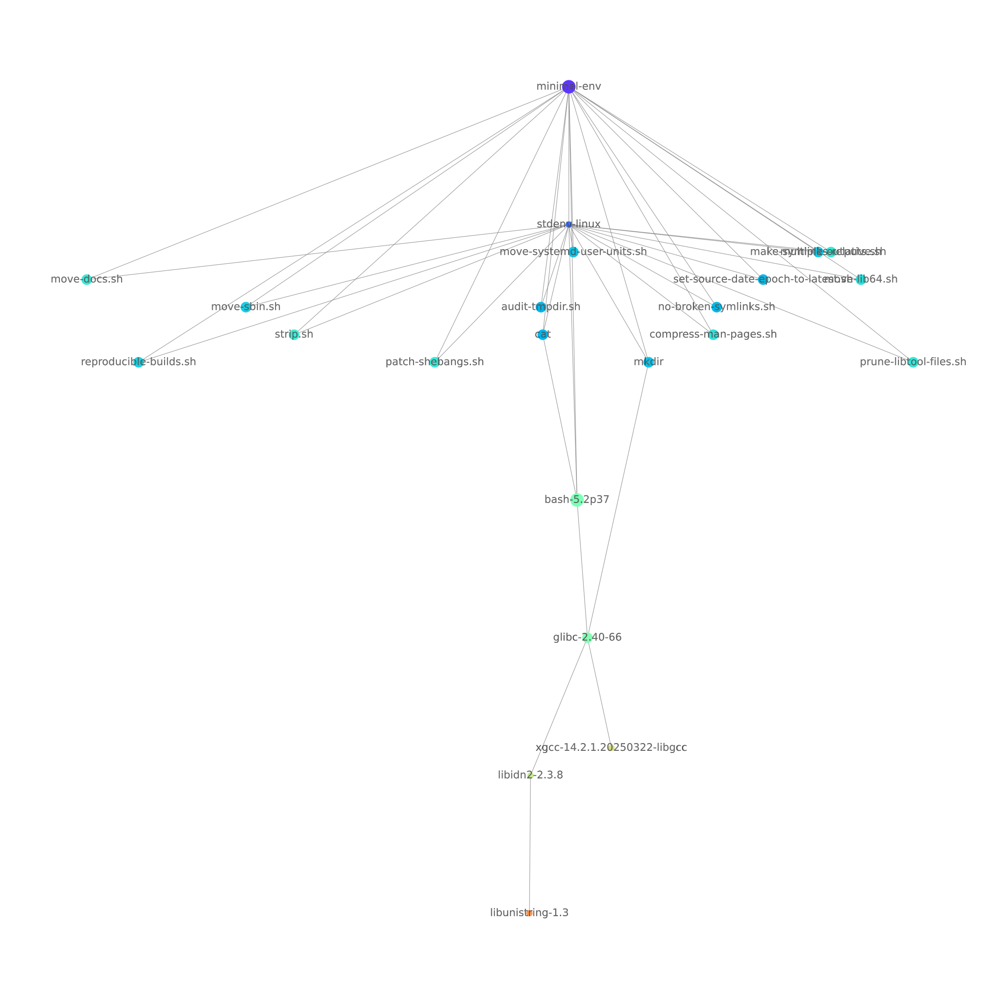

# Even More Minimal devShell

Based on https://fzakaria.com/2021/08/02/a-minimal-nix-shell.html . Now without coreutils.

```console
$ nix path-info --closure-size --human-readable $(nix develop --command bash -c 'echo ${NIX_GCROOT}')
/nix/store/vfr941260fa6ifazbw45xjg5f1a6g7q7-minimal-env    9.7 MiB
```

```console
$ nix run nixpkgs#nix-tree -- $(nix develop --command bash -c 'echo ${NIX_GCROOT}')
```


